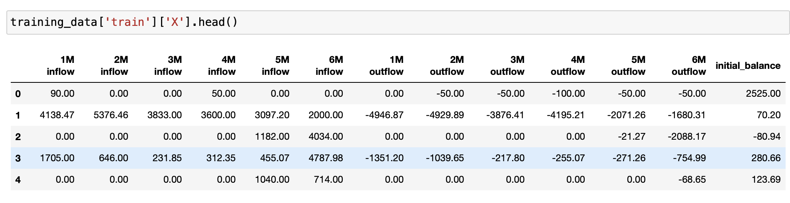

# Predict next month outflow

## Project description
Set up a prediction function that takes an account, a list of transactions recorded on the account over a 6 month 
period, and ouputs a prediction for the aggregated next month outgoing for that account.

## Environment set-up
- Create an environment with dependencies listed in requirements-eda.txt
- To use this environment in the jupyter notebook type:
```bash
> ipython kernel install --user --name=<your-env-name>
```
 ## code organisation
- root level:
  - main.py: code for deployment with Fast API. Account end balance and an history of transactions 
of at least 6 months are provided as input and the expected outgoing over the next moth is returned.
  - mansa_loans.ipynb: EDA and experimentations are done on a jupyter notebook  which
contains details on the steps followed for building the model. 
  - requirements.txt: minimal set of dependencies necessary to run the api.
  - requirements-eda.txt: all dependencies necessary to run the api and the jupyter notebook mansa_loans.ipynb.
- data folder contains the two csv files used for our anlysis: 
  - accounts.csv
  - transactions.csv.
- models folder: models saved using joblib.
- src folder contains the code (except the code concerning the api set up) and the tests:
  - data_tools.py: library of functions used to manipulate data.
  - hyper_params.py: file used to define the objective function used by Optuna when fine-tuning hyper-parameters.
  - model.py: library of methods for model manipulation.
  - tools.py: library of general purpose functions
  - train_lgbm.py: training and evaluation of the model
  - tests folder: group the test files. Each test file corresponding to a file in src, with the exception of 
test_main.py that is for testing the api.
    - test_data_tools.py
    - test_main.py
    - test_model.py
    - test_tools.py

## Method used
The different steps of the approach followed are detailed in the jupyter notebook.

### EDA: 
  - We start with an EDA that reveals that there are no null values in the data but there are duplicates
    (5% of the data). It is difficult, without further information, to know if the duplicated transactions are 
  legitimate similar transactions or duplicates coming from an error when the data were processed. 
  We decide to keep these duplicates. It would be interesting to enrich the transactions data with a transaction id. 
  We could decide with certainty with such an id if similar transactions on a given account and a given date are
  duplicates or legitimates.
  - **Selecting accounts with more than 6 months history**: 823 accounts, which represent 65% of all the accounts, have an history of more than 6 months. We want to build a 
model that make predictions using 6 months of data so we'll focus on accounts with more than 6 months history. 
We use **get_df_with_history** in  **data_tools.py** to select these accounts.

### Processing the data for training
- We are looking to predict the next month outgoing given the last 6 month of transaction. For that purpose it make 
sense to divide the history of transactions in 30 days buckets and to calculate the total amount of inflow and outflow 
for each 30 days bucket.
- The function used for that purpose is **get_training_data** in **data_tools.py**.
- When processing the data, we keep the last 2 months for testing and the previous 2 months for validation so that we 
are sure there is no data leakage when training and testing. 
- For some accounts there are more than 11 months of data. In this case we'll get from the account several training 
samples. For example if an account has 12 month of data, the last 4 months are used for validation and testing, so we 
are left with 8 months of data for training. We'll have then 2 training samples from this account (2 rows in X_train):
  - one sample with the first 6 months for predicting the 7th month
  - A second sample starting from the 2nd month and ending at the 7th month for predicting the 8th month.
- The data are split between training, validation and test. Each of these split is a dictionary with the features: 'X' 
and the target variable: 'y'. There is a total of 13520 examples, the relative proportion of the different 
splits is as follow:
  - 75.5% for training
  - 12.3% for validation
  - 12.2% for testing
In each case the dataframe X is as follow:

These data represent 6 months of transaction history. For example, '1M inflow' gives the total amount of positive 
transactions in the accounts during the first month of the history considered and '6M outflow' gives the total amount 
of negative transaction in the accounts during the last month of the history considered. initial_balance give the balances of the account at the beginning of the 6 months period considered.

### Model choice
- Given that time is limited we'll compare different model performance with their default setting to choose our model.
- we perform some scaling on the data. It is not necessary for tree based models but we'll keep a common 
groundwork for our analysis
- The models considered are:
  - regression
  - regression with lasso penalization
  - regression with ridge panalization
  - random forest
  - LightGBM

We get the best r2 score for LightGBM (28.4%) so we keep that model for the next steps.

### Hyperparameters tuning for LightGBM
We use Optuna for hyperparameters tuning of our LightGBM model. The results of the study make us tune the following 
hyperparameters to:
- 'n_estimators': 2000,
- 'reg_alpha': 2.19,
- 'reg_lambda': 3.18,
- 'colsample_bytree': 0.4,
- 'subsample': 0.8,
- 'learning_rate': 0.014,
- 'max_depth': 10,
- 'num_leaves': 39,
- 'min_child_samples': 116

Setting the hyperparameters as such leads to a r2 of 34.8% on validation data, much better thant the 
28.4% obtained previously

### Test results
On test results we get a r2 of 33.6% close to the r2 obtained on validation data which is positive.
On the other hand the rmse is still too large at 188% of the average target variable value.


 


